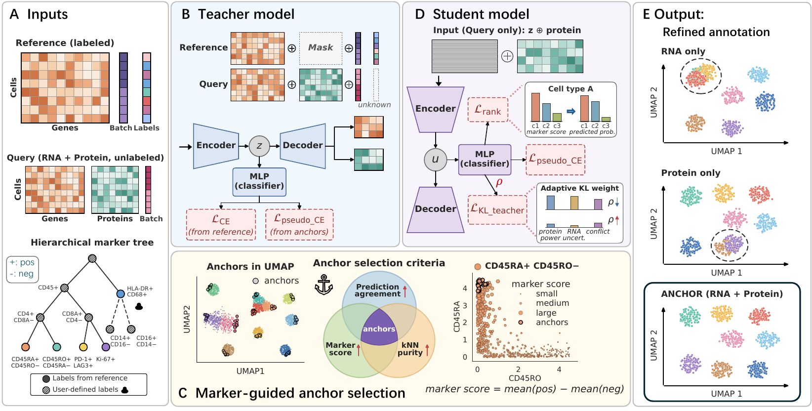

# ANCHOR

ANCHOR (**AN**notating **C**ells with **H**ierarchical marker-**O**riented **R**egularization) is a Python package for marker-guided cell-type annotation in paired RNA-protein single-cell or spatial data. ANCHOR combines a labeled scRNA-seq reference, an RNA-protein query dataset, and a user-provided hierarchical protein marker tree through a teacher-student training framework.

## Method overview



**Overview of the ANCHOR framework.** **(A)** ANCHOR takes as input a labeled scRNA-seq reference, an unlabeled RNA-protein query, and a hierarchical marker tree whose nodes carry positive (`+`) and negative (`-`) protein markers. Solid branches denote reference-labeled types; dashed branches denote user-defined subtypes resolved through markers alone. **(B)** The teacher model jointly trains on reference and query via a VAE-based encoder-decoder. Reference labels supervise the classifier, augmented by anchor pseudo-labels for query cells. **(C)** Anchors are query cells for which classifier prediction, protein marker score, and KNN purity agree. Selected anchors occupy unambiguous positions in the embedding. **(D)** The student model trains on query cells only, using teacher latent features and protein measurements as input. It is guided by anchor pseudo-labels, a rank loss that aligns predicted probabilities with marker-score ordering, and a KL term with node-wise adaptive weighting. **(E)** Final annotations integrate RNA-derived structure with protein-resolved cell states.

## Installation

```bash
git clone https://github.com/yudan121/ANCHOR.git
cd ANCHOR
python -m pip install -e .
```

## Quick start

```python
from anchor import run_anchor

result = run_anchor(
    reference="path/to/reference.h5ad",
    query="path/to/query.h5ad",
    marker_tree="path/to/marker_tree.json",
    results_dir="path/to/anchor_results",
    run_name="my_anchor_run",
    batch_key="batch",
    celltype_key="cell_type",
    query_label_key=None,
)
print(result.final_dir)
```

`reference` and `query` can be `.h5ad` paths or loaded `AnnData` objects. `marker_tree` can be a JSON path, a nested Python dictionary, or a `MarkerTree` object.

To train only the student from existing teacher outputs under `results_dir / run_name / round2`, use:

```python
from anchor import run_student

run_student(
    reference="path/to/reference.h5ad",
    query="path/to/query.h5ad",
    marker_tree="path/to/marker_tree.json",
    results_dir="path/to/anchor_results",
    run_name="my_anchor_run",
    batch_key="batch",
    celltype_key="cell_type",
)
```

## Input data

ANCHOR expects:

- A labeled reference `.h5ad` containing RNA counts and reference cell-type labels.
- A query `.h5ad` containing RNA and protein measurements.
- A marker tree describing positive and negative protein markers for cell states or internal branches.

The default example scripts assume these column names:

- `batch`: batch, donor, sample, or processing-site label.
- `cell_type`: reference cell-type label, and query ground truth when available.

Use the `batch_key`, `celltype_key`, and `query_label_key` arguments, or the environment variables documented in `reproduce/README.md`, if your files use different names.

## Marker tree schema

Each marker-tree node is a JSON object with:

- `name`: node or cell-type name.
- `positive_markers`: optional list of protein markers expected to be high.
- `negative_markers`: optional list of protein markers expected to be low.
- `children`: optional list of child nodes.

Minimal example:

```json
{
  "name": "root",
  "children": [
    {
      "name": "T cell",
      "positive_markers": ["CD3"],
      "negative_markers": ["CD19"]
    },
    {
      "name": "B cell",
      "positive_markers": ["CD19"],
      "negative_markers": ["CD3"]
    }
  ]
}
```

## Expected output

Each run writes a run directory containing teacher rounds, student outputs, node-wise rho audit tables, selected anchors, metrics when query labels are available, and a final decision report. If the student safety guard detects excessive loss of teacher-supported rare classes, ANCHOR falls back to the teacher output for the final annotation.

## Reproducibility

The `reproduce/` directory contains scripts for the ANCHOR experiments described in the thesis:

- `simulation_full_mode`
- `simulation_partial_label_mode`
- `bmmc_full_mode`
- `bmmc_partial_label_mode`
- `marrowatlas`
- `bm_abseq`
- `pbmc`
- `xenium_ccrcc_full_mode`
- `xenium_ccrcc_b_plasma_partial_label_mode`

See `reproduce/README.md` for details.

## Data availability

The processed input files for reproducing the ANCHOR experiments will be deposited on Zenodo. Zenodo DOI: **coming soon**.

The original public datasets used in the ANCHOR experiments are available from the following sources:

- The bone marrow mononuclear cells dataset (BMMC) profiled by CITE-seq is from the [NeurIPS 2021 Multimodal Single-Cell Data Integration Challenge](https://openproblems.bio/events/2021-09_neurips) and is available through the [Gene Expression Omnibus (GEO)](https://www.ncbi.nlm.nih.gov/geo/) under accession [GSE194122](https://www.ncbi.nlm.nih.gov/geo/query/acc.cgi?acc=GSE194122).

- The human bone marrow proteo-genomic atlas (MarrowAtlas) profiled by CITE-seq is available through GEO under accession [GSE245108](https://www.ncbi.nlm.nih.gov/geo/query/acc.cgi?acc=GSE245108).

- The human bone marrow dataset (BM AbSeq), generated using BD Rhapsody Whole Transcriptome Analysis with AbSeq protein profiling, is available through [figshare](https://figshare.com/projects/Single-cell_proteo-genomic_reference_maps_of_the_human_hematopoietic_system/94469). We used the [healthy-donor dataset with 97 surface markers](https://figshare.com/articles/dataset/Expression_of_97_surface_markers_and_RNA_transcriptome_wide_in_13165_cells_from_a_healthy_young_bone_marrow_donor/13397987).

- The peripheral blood mononuclear cells dataset (PBMC) profiled by CITE-seq is available through GEO under accession [GSE164378](https://www.ncbi.nlm.nih.gov/geo/query/acc.cgi?acc=GSE164378).

- The human renal cell carcinoma dataset profiled by the Xenium In Situ Gene and Protein Expression with Cell Segmentation Staining workflow is available from the [10x Genomics project website](https://www.10xgenomics.com/datasets/xenium-protein-ffpe-human-renal-carcinoma).

- The labeled human clear cell renal cell carcinoma reference dataset was profiled by scRNA-seq. The raw data are available through the NCBI Trace archive at [SRZ190804](https://trace.ncbi.nlm.nih.gov/Traces/index.html?analysis=SRZ190804). The processed public collection is available through [CZ CELLxGENE](https://cellxgene.cziscience.com/collections/3f50314f-bdc9-40c6-8e4a-b0901ebfbe4c).


## System requirements

ANCHOR depends on `anndata`, `scanpy`, `scvi-tools`, `torch`, `numpy`, `pandas`, `scikit-learn`, `scipy`, `matplotlib`, and `seaborn`. Full benchmark-scale runs were tested on Linux servers with NVIDIA GPUs. Small input-validation and student-only checks can be run on CPU, but full teacher training is expected to be slow without GPU acceleration.

## Version history

The experiments were generated with the v1 release. The v2 release keeps the same teacher, anchor selection, student training, and safety-guard pipeline, and updates only the node-wise rho policy used for the student conditional KL loss.

- `v1.0.0-formal-compatible`: ANCHOR release used for the primary reported experiments.
- `v2.0.0-hybrid-rho`: same training pipeline with the hybrid rho policy, which simplifies the protein-power and teacher-challenge components.
